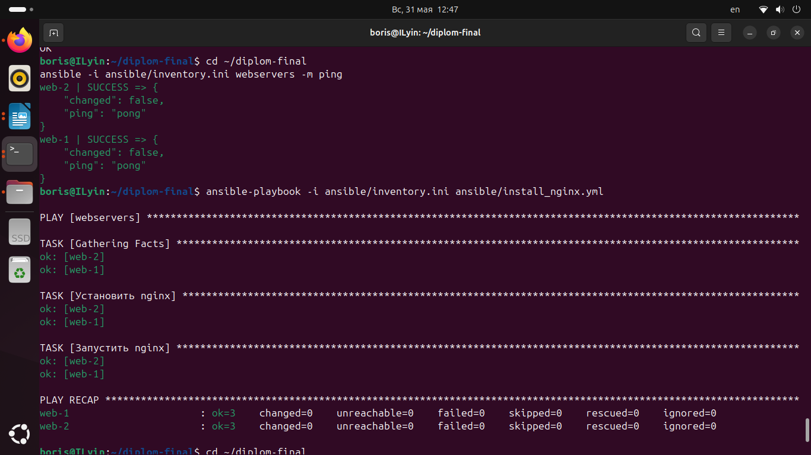
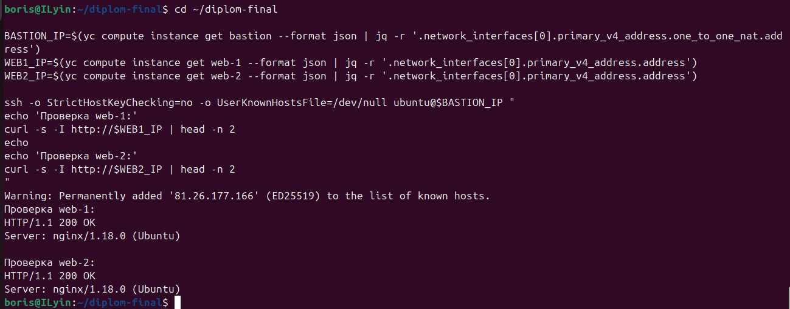
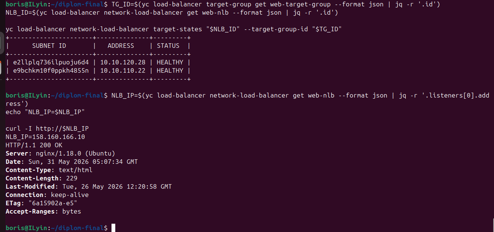

# Дипломный проект Ильин Б

## Описание

Проект по развёртыванию веб-инфраструктуры в Yandex Cloud.

Инфраструктура создаётся с помощью Terraform.
Настройка серверов выполняется с помощью Ansible.

В результате развёрнуты web-серверы с nginx и балансировщик нагрузки.

## Что сделано

- создана облачная инфраструктура в Yandex Cloud;
- созданы виртуальные машины;
- настроен bastion host;
- настроены два web-сервера с nginx;
- web-серверы находятся во внутренней сети;
- доступ к web-серверам выполняется через bastion host;
- настроен сетевой балансировщик нагрузки;
- проверена доступность web-серверов;
- проверена работа балансировщика нагрузки.

## Схема работы

Пользователь обращается к сайту через внешний IP-адрес балансировщика нагрузки.

Балансировщик распределяет HTTP-запросы между двумя web-серверами nginx.

Web-серверы находятся во внутренней сети и не имеют прямого публичного доступа.

Для административного подключения используется bastion host.

Internet
   |
   | HTTP :80
   |
Network Load Balancer
   |
   | HTTP :80
   |
-------------------------
|                       |
web-1                   web-2
nginx                   nginx
private IP              private IP

Admin
   |
   | SSH
   |
Bastion host
   |
   | SSH
   |
web-1 / web-2
Проверка Ansible

Проверка доступности web-серверов через Ansible
ansible -i ansible/inventory.ini webservers -m ping

Запуск playbook для установки nginx
ansible-playbook -i ansible/inventory.ini ansible/install_nginx.yml

Результат выполнения Ansible

Проверка web-серверов

Проверка web-серверов выполнялась через bastion host.

Команды получают внутренние IP-адреса web-серверов и проверяют ответ nginx
WEB1_IP=$(yc compute instance get web-1 --format json | jq -r '.network_interfaces[0].primary_v4_address.address')
WEB2_IP=$(yc compute instance get web-2 --format json | jq -r '.network_interfaces[0].primary_v4_address.address')

Проверка nginx на web-1 и web-2
curl -s -I http://$WEB1_IP | head -n 2
curl -s -I http://$WEB2_IP | head -n 2

Оба web-сервера отвечают

Проверка балансировщика нагрузки

Проверка состояния target group
yc load-balancer network-load-balancer target-states "$NLB_ID" --target-group-id "$TG_ID"

Оба backend-сервера имеют статус
text

HEALTHY

Проверка сайта через балансировщик
curl -I http://158.160.166.10

Адрес сайта
Сайт доступен через балансировщик нагрузки:
text

http://158.160.166.10

Проверка
curl -I http://158.160.166.10

Terraform

Terraform используется для создания инфраструктуры в Yandex Cloud.

Файлы Terraform находятся в репозитории

   сеть
   подсети
   виртуальные машины
   bastion host
   web-серверы
   сетевой балансировщик нагрузки
   target group
   правила безопасности.

Ansible

Ansible используется для настройки web-серверов.

Файлы Ansible находятся также в репозитории

Ansible выполняет

   проверку доступности серверов
   установку nginx
   запуск nginx
   включение nginx в автозагрузку.

Структура проекта

diplom-final
    ansible
    terraform
    screenshots
       screenshot1.png
       screenshot2.png
       screenshot3.png
    README.md

Используемые инструменты

    Yandex Cloud
    Terraform
    Ansible
    nginx
    Network Load Balancer

